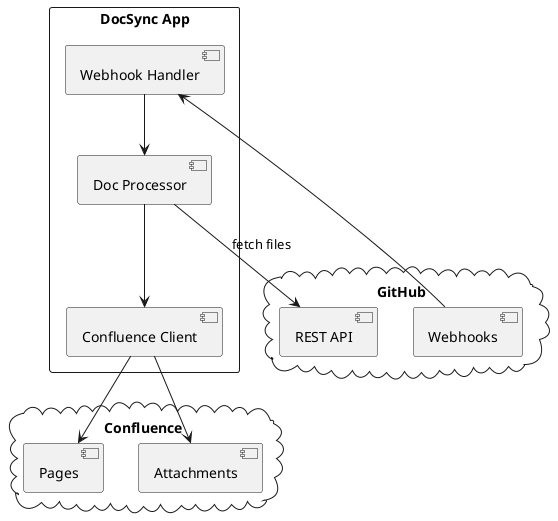
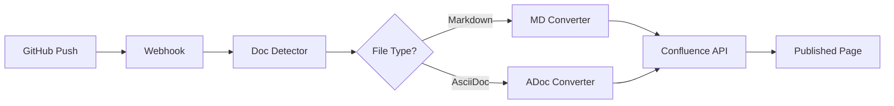

# Architecture Overview

This document describes the system architecture.

## Component Diagram

## Data Flow

## Key Decisions

- **FastAPI** chosen for async webhook handling
- **SQLite** for local state (delivery dedup, page mappings)
- **Domain-driven design** for clear separation of concerns
